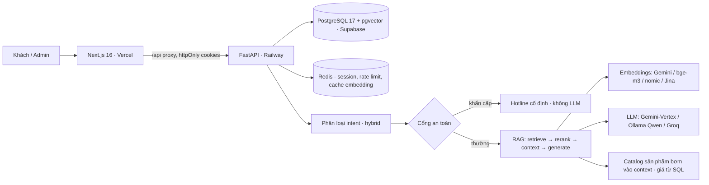

# Qiki — Trợ lý AI bán gas cho cửa hàng LPG Việt Nam

Qiki là trợ lý AI của **Cửa hàng Gas Quốc Cường** — một storefront full-stack đang chạy
production, bán gas LPG và nước uống đóng bình tại TP. Hồ Chí Minh. Khách hàng duyệt sản
phẩm, đặt hàng, hoặc trò chuyện: Qiki trả lời bằng tiếng Việt (hoặc tiếng Anh theo ngôn ngữ
giao diện), **báo giá live từ catalog**, xử lý khẩn cấp an toàn gas bằng phản hồi cứng, lên
đơn gas & nước, và cho admin **quản trị catalog bằng ngôn ngữ tự nhiên** — tất cả dựa trên
pipeline RAG có cổng an toàn đặt trước.

[](https://github.com/Rhynis/Qiki/actions/workflows/ci-backend.yml)
[](https://github.com/Rhynis/Qiki/actions/workflows/ci-frontend.yml)


[](LICENSE)

**Live:** Storefront (Vercel) · Backend API + `/docs` (Railway) · Repo `Rhynis/Qiki` (private)

> 🇻🇳 **Tiếng Việt (mặc định, bên dưới)** · 🇬🇧 [**English**](#-english) (ở cuối trang)

---

## 🇻🇳 Tiếng Việt

### Điểm nhấn: Qiki xử lý được gì

Qiki phân loại mỗi tin nhắn vào **8 nhóm intent** và xử lý mỗi nhóm theo một đường riêng —
đường an toàn và đường giá **không** đi qua LLM để không thể bịa:

| Intent | Qiki làm gì | Ví dụ khách hỏi |
| --- | --- | --- |
| **Hỏi sản phẩm** (`product_inquiry`) | Báo giá **chính xác từ catalog**; liệt kê theo size gọn theo hãng→giá; câu "rẻ nhất/đắt nhất/tầm giá" giải bằng **SQL**; hỏi lại hãng/màu khi có nhiều biến thể | "các loại bình 12kg", "gas nào rẻ nhất", "bình Elf 12kg bao nhiêu" |
| **Đặt hàng** (`place_order`) | Trích slot từ hội thoại (sản phẩm, số lượng, địa chỉ), xác nhận, tạo đơn thật (SERIALIZABLE + `SELECT FOR UPDATE`, **không oversell**); dùng lại địa chỉ mặc định của khách đã đăng nhập | "cho 2 bình Saigon Petro 12kg giao Bình Thạnh" |
| **Tra đơn** (`delivery_status`) | Tra trạng thái đơn theo mã / khách hàng | "đơn của tôi tới đâu rồi" |
| **Khiếu nại** (`complaint`) | Escalate cho nhân viên; ghi note; xin gọi lại | "giao trễ quá, tôi muốn khiếu nại" |
| **Sự cố kỹ thuật** (`technical_issue`) | Hướng dẫn cơ bản + escalate khi cần | "bếp không lên lửa" |
| **🚨 Khẩn cấp an toàn** (`safety_emergency`) | **Trả về hằng số hotline cố định (090 3026306 + 114/115), KHÔNG bao giờ gọi LLM**; double-check bằng LLM dù confidence cao để không bỏ sót | "ngửi mùi gas", "bình gas bị cháy" |
| **Sự cố thanh toán** (`payment_issue`) | Hỗ trợ/escalate luồng thanh toán | "tôi chuyển khoản rồi mà chưa thấy" |
| **Thông tin chung** (`general_info`) | Trả lời FAQ (giờ mở cửa, khu vực giao, chính sách) từ KB; câu ngoài phạm vi → lịch sự lái về gas/nước | "mấy giờ đóng cửa", "giao Thủ Đức không" |

Ngoài ra, khi **đăng nhập bằng admin**, Qiki nhận lệnh **quản trị bằng ngôn ngữ tự nhiên**
(đổi giá / tồn kho / ẩn-hiện sản phẩm) — luôn **bắt buộc xác nhận**, ghi **audit log**, và có
**guard optimistic-concurrency** (nếu giá trị đã thay đổi giữa lúc xem và lúc xác nhận thì hủy,
không ghi đè).

### Pipeline mỗi lượt chat

```
Tin nhắn
  → Phân loại intent (hybrid: embedding conf ≥ 0.7 → dùng embedding; < 0.7 → LLM fallback)
  → 🚦 Cổng an toàn (khớp keyword/pattern → phản hồi khẩn cấp CỐ ĐỊNH, dừng, không LLM)
  → Truy hồi hybrid (vector similarity + BM25 keyword trên KB 48 tài liệu)
  → Rerank (LLM listwise, tùy chọn qua RAG_RERANK_ENABLED)
  → Dựng context (đoạn KB liên quan + CATALOG SẢN PHẨM live bơm vào)
  → Sinh câu trả lời (streaming SSE; giá đọc thẳng từ SQL, không để model đoán)
  → Lưu lịch sử (persist cả khi client ngắt giữa chừng: try/finally + asyncio.shield)
```

- **Confidence thấp** (`intent_confidence < 0.6`) hoặc khách **chấm 👎** → tự đánh dấu `flagged_for_review` cho vòng continuous-learning.
- **4 không gian vector** cắm-rút: Gemini (768) / Jina v3 (768, fallback) / Ollama nomic (768) / **bge-m3 (1024)** cho chế độ local.
- **Cache embedding câu hỏi (Redis)** → câu lặp lại bỏ qua round-trip tới provider.

### Tính năng storefront & vận hành

**Storefront**
- Catalog gas 6/12/45 kg + nước uống, có **biến thể sản phẩm** (sản phẩm cha + tùy chọn màu/loại).
- Giỏ hàng, thanh toán khách vãng lai & tài khoản, **giao nhiều địa chỉ/nhiều đợt**, theo dõi đơn, **đặt lại đơn cũ** + **bán chạy**.
- **Mã giảm giá & khuyến mãi**, **wishlist**, **đăng ký báo giá qua email**, **hóa đơn điện tử** (adapter).
- **Giao diện song ngữ (Việt/Anh) trên TẤT CẢ các trang**; Qiki chào & trả lời theo đúng ngôn ngữ đang chọn.

**Quản trị & vận hành**
- Dashboard: hội thoại (trạng thái, cờ, escalation, nhân viên trả lời), đơn hàng, sản phẩm, KB, người dùng, cẩm nang trong app.
- **Admin-in-chat** (nêu trên), **vai trò tài xế (driver) + khu vực driver trong app**, **backup DB mã hóa hằng ngày + health-monitor / auto-failover**.
- **Provider AI cắm-rút**: Gemini (Vertex) / Ollama Qwen 2.5 7B (local) / **Groq** (primary tùy chọn) qua biến môi trường; chế độ "hybrid local demo" qua Cloudflare Tunnel.

### Số liệu đo được

Số thật từ repo (không phải mục tiêu):

| Chỉ số | Giá trị | Nguồn |
| --- | --- | --- |
| **Phát hiện khẩn cấp an toàn** | **100%** trên 86 case, **0% dương tính giả** | `run_evaluation.py --suite safety` (**cổng cứng CI**, exit ≠ 0 nếu < 100%) |
| Bộ đánh giá | **232 case** — intent **96** · rag **50** · safety **86** | `backend/data/eval/*.json` |
| Test tự động | **910 backend + ~90 frontend** | pytest / vitest + Playwright e2e |
| Coverage backend | **~88%** (service layer cao hơn) | `pytest --cov` trong CI |
| Chất lượng truy hồi (bge-m3, VN) | doc liên quan **0.62–0.71** vs lệch chủ đề **< 0.55** (tách bạch rõ) | đo trên KB 48 doc production |
| Knowledge base | **48 tài liệu** tiếng Việt (sản phẩm, an toàn, giao hàng, FAQ) | `backend/data/knowledge_base/` |

> An toàn được assert ở tầng test: `test_safety_query_does_not_call_llm` kiểm tra
> `llm.generate.assert_not_called()` — model **không hề được gọi** trên đường khẩn cấp.
>
> Latency, Lighthouse, độ chính xác intent và RAGAS context-precision chưa được tự động hóa
> ở đây; **cố tình bỏ trống thay vì ước lượng.**

### Kiến trúc



Chi tiết: [kiến trúc](docs/architecture.md) · [quyết định/ADR](docs/architecture-decisions.md) · [pipeline chatbot](docs/chatbot-pipeline.md) · [RAG local](docs/LOCAL_RAG.md).

### Tech stack

| Lớp | Công nghệ |
| --- | --- |
| Frontend | Next.js 16 (App Router), TypeScript (strict), Tailwind, shadcn/ui, TanStack Query, next-intl (i18n) |
| Backend | FastAPI, Python 3.11, async SQLAlchemy 2.0, Pydantic v2, Alembic (head `021`) |
| Database | PostgreSQL 17 + pgvector (Supabase) |
| Cache | Redis 7 (session, rate limit, blacklist token, cache embedding) |
| Generation | Gemini (Vertex) · Ollama Qwen 2.5 7B (local) · Groq (primary tùy chọn / fallback) |
| Retrieval | 4 không gian vector — Gemini `gemini-embedding-001` (768), Jina `v3` (768, fallback), Ollama `nomic-embed-text` (768), `bge-m3` (1024) |
| Eval / Obs | DeepEval, chỉ số kiểu RAGAS, Langfuse, Sentry |
| Deploy | Vercel · Railway · Supabase · Cloudflare Tunnel (demo local) |

### Bắt đầu nhanh

```bash
cp .env.example .env    # điền secret (DB, Redis, khóa LLM)
make docker-up          # Postgres + Redis
make dev                # backend (FastAPI) + frontend (Next.js)
```

Chạy **local hoàn toàn / offline** (không cần khóa cloud AI): xem [docs/local-demo-mode.md](docs/local-demo-mode.md) —
pull model Ollama, đặt `LLM_PROVIDER=ollama` + `EMBEDDING_PROVIDER=bge`. Tùy chọn:
`LLM_PROVIDER=groq`, `EMBEDDING_QUERY_CACHE_TTL` (mặc định 3600s).

### Cấu trúc dự án

```text
frontend/    App Next.js 16 (storefront + admin + widget chat Qiki), song ngữ next-intl
backend/     FastAPI: api → services → repositories; intent, RAG, safety, eval, migrations (head 021)
docs/        kiến trúc, ADR, API, security, deployment, vận hành, RAG-local
cloudflare/  Cấu hình Cloudflare Tunnel cho chế độ demo-local
.github/     CI (lint, type-check, mypy, test, e2e, cổng coverage, eval safety) + deploy
```

### Quyết định kỹ thuật đáng chú ý

- **An toàn không bao giờ giao cho LLM** — khẩn cấp khớp rule keyword/pattern, trả hằng số hotline; test assert model không được gọi; cổng 100% trong CI.
- **Giá lấy từ catalog, không từ LLM/KB** — catalog bơm vào context; câu hỏi giá/size/rẻ nhất giải bằng SQL, model nhỏ không thể báo sai.
- **Provider cắm-rút** — Strategy/Factory trên 3 generator × 4 không gian embedding; cùng một chatbot chạy cloud hoặc offline hoàn toàn.
- **Không oversell** — tạo đơn dùng SERIALIZABLE + `SELECT FOR UPDATE`; test `test_concurrent_decrement_no_oversell` chạy 10 task song song trên Postgres thật.
- **Streaming persist khi client ngắt** (try/finally + `asyncio.shield`) + **optimistic-concurrency** cho admin-in-chat.
- **Auth httpOnly-cookie** — không token trong JS; cookie access/refresh + blacklist Redis.
- **Migration an toàn asyncpg** — mỗi statement một `op.execute()`; hàm/trigger DB cho mã đơn & mã hội thoại.

Danh sách đầy đủ: [docs/architecture-decisions.md](docs/architecture-decisions.md).

### Tài liệu

[kiến trúc](docs/architecture.md) · [quyết định](docs/architecture-decisions.md) · [api](docs/api.md) · [pipeline chatbot](docs/chatbot-pipeline.md) · [RAG local](docs/LOCAL_RAG.md) · [demo local](docs/local-demo-mode.md) · [security](docs/security.md) · [deployment](docs/deployment.md) · [hosting](docs/HOSTING.md) · [vận hành](docs/operations.md) · [phát triển](docs/development.md) · [việc tương lai](docs/future-work.md)

### Đóng góp

1. Tạo branch từ `main`.
2. Code, comment, docs, commit message bằng **tiếng Anh**; UI, prompt LLM, nội dung KB bằng **tiếng Việt**.
3. Chạy test + linter (`ruff`, `mypy`, `eslint`, `prettier`) trước khi mở PR.

### License

MIT. Xem [LICENSE](LICENSE).

---

## 🇬🇧 English

Qiki is the AI assistant behind **Cửa hàng Gas Quốc Cường**, a production full-stack storefront
selling LPG gas and bottled water in Ho Chi Minh City. Customers browse the catalog, place
orders, or just chat: Qiki answers in Vietnamese (or English, following the UI locale), quotes
**live catalog prices**, defuses gas-safety emergencies with a hard-coded response, takes gas &
water orders, and lets an admin **manage the catalog in natural language** — all grounded in a
RAG pipeline with a safety gate that runs first.

### Highlight: what Qiki handles

Qiki classifies every message into **8 intents** and routes each down its own path — the safety
and pricing paths deliberately **bypass the LLM** so it can't fabricate:

| Intent | What Qiki does | Example |
| --- | --- | --- |
| **Product inquiry** (`product_inquiry`) | **Exact prices from the catalog**; compact size lists grouped by brand→price; "cheapest/most-expensive/around" resolved via **SQL**; asks which brand/colour when there are many variants | "các loại bình 12kg", "which gas is cheapest", "how much is Elf 12kg" |
| **Place order** (`place_order`) | Extracts slots from the chat (product, qty, address), confirms, creates a real order (SERIALIZABLE + `SELECT FOR UPDATE`, **no oversell**); reuses a logged-in customer's default address | "2 Saigon Petro 12kg to Bình Thạnh" |
| **Delivery status** (`delivery_status`) | Looks up order status by code / customer | "where is my order" |
| **Complaint** (`complaint`) | Escalates to staff; records a note; offers a callback | "delivery was late, I want to complain" |
| **Technical issue** (`technical_issue`) | Basic guidance + escalation when needed | "the stove won't light" |
| **🚨 Safety emergency** (`safety_emergency`) | **Returns a fixed hotline constant (090 3026306 + 114/115), NEVER calls the LLM**; double-checked by the LLM even at high confidence so nothing slips through | "I smell gas", "the cylinder is on fire" |
| **Payment issue** (`payment_issue`) | Assists / escalates the payment flow | "I transferred but it's not showing" |
| **General info** (`general_info`) | Answers FAQ (hours, delivery zones, policy) from the KB; out-of-scope questions are politely steered back to gas/water | "closing time?", "do you deliver to Thủ Đức?" |

When signed in **as admin**, Qiki also takes **natural-language admin commands** (change
price / stock / hide-show a product) — always with **mandatory confirmation**, an **audit log**,
and an **optimistic-concurrency guard** (if the value changed between preview and confirm, it
aborts instead of overwriting).

### Per-turn pipeline

```
Message
  → Intent classify (hybrid: embedding conf ≥ 0.7 → embedding; < 0.7 → LLM fallback)
  → 🚦 Safety gate (keyword/pattern match → FIXED emergency response, stop, no LLM)
  → Hybrid retrieval (vector similarity + BM25 keyword over the 48-doc KB)
  → Rerank (LLM listwise, optional via RAG_RERANK_ENABLED)
  → Context build (relevant KB chunks + the live PRODUCT CATALOG injected)
  → Generate (streaming SSE; prices read straight from SQL, never guessed)
  → Persist history (even on mid-stream client disconnect: try/finally + asyncio.shield)
```

- **Low confidence** (`intent_confidence < 0.6`) or a customer **👎** → auto-set `flagged_for_review` for the continuous-learning loop.
- **4 pluggable vector spaces**: Gemini (768) / Jina v3 (768, fallback) / Ollama nomic (768) / **bge-m3 (1024)** for local mode.
- **Redis query-embedding cache** → repeated questions skip the provider round-trip.

### Storefront & ops features

**Storefront** — catalog (gas 6/12/45 kg + water) with **product variants**; cart, guest &
account checkout, **multi-address / multi-delivery**, order tracking, **re-order** + **best-sellers**;
**coupons & promotions**, **wishlist**, **price-alert email subscription**, **e-invoice** (adapter);
**full bilingual UI (VI/EN) on all pages** with Qiki greeting/replies following the chosen locale.

**Admin & ops** — dashboard (chats, orders, products, KB, users, in-app guide); admin-in-chat
(above); **driver role + in-app driver section**; **daily encrypted DB backup + health-monitor /
auto-failover**; **pluggable AI providers** (Gemini / Ollama / **Groq**) + a Cloudflare-tunnel local demo.

### Measured metrics

Real numbers from this repo (not targets):

| Metric | Value | Source |
| --- | --- | --- |
| **Safety-emergency detection** | **100%** over 86 cases, **0% false positives** | `run_evaluation.py --suite safety` (**CI hard gate**, exits ≠ 0 below 100%) |
| Eval suites | **232 cases** — intent **96** · rag **50** · safety **86** | `backend/data/eval/*.json` |
| Automated tests | **910 backend + ~90 frontend** | pytest / vitest + Playwright e2e |
| Backend coverage | **~88%** (service layer higher) | `pytest --cov` in CI |
| Retrieval quality (bge-m3, VN) | relevant docs **0.62–0.71** vs off-target **< 0.55** (cleanly separable) | measured on the 48-doc production KB |
| Knowledge base | **48 Vietnamese docs** (products, safety, delivery, FAQ) | `backend/data/knowledge_base/` |

> Safety is asserted at the test layer: `test_safety_query_does_not_call_llm` checks
> `llm.generate.assert_not_called()` — the model is **never invoked** on the emergency path.
>
> Latency, Lighthouse, intent-accuracy and RAGAS context-precision benchmarks are not yet
> automated here; they are intentionally omitted rather than estimated.

### Architecture

See the diagram in the Vietnamese section above (labels are the only difference). Details:
[architecture](docs/architecture.md) · [ADRs](docs/architecture-decisions.md) · [chatbot pipeline](docs/chatbot-pipeline.md) · [local RAG](docs/LOCAL_RAG.md).

### Tech stack

| Layer | Technology |
| --- | --- |
| Frontend | Next.js 16 (App Router), TypeScript (strict), Tailwind, shadcn/ui, TanStack Query, next-intl (i18n) |
| Backend | FastAPI, Python 3.11, async SQLAlchemy 2.0, Pydantic v2, Alembic (head `021`) |
| Database | PostgreSQL 17 + pgvector (Supabase) |
| Cache | Redis 7 (sessions, rate limiting, token blacklist, embedding cache) |
| Generation | Gemini (Vertex) · Ollama Qwen 2.5 7B (local) · Groq (optional primary / fallback) |
| Retrieval | 4 vector spaces — Gemini `gemini-embedding-001` (768), Jina `v3` (768, fallback), Ollama `nomic-embed-text` (768), `bge-m3` (1024) |
| Eval / Obs | DeepEval, RAGAS-style metrics, Langfuse, Sentry |
| Deployment | Vercel · Railway · Supabase · Cloudflare Tunnel (local demo) |

### Quick start

```bash
cp .env.example .env    # fill secrets (DB, Redis, LLM keys)
make docker-up          # Postgres + Redis
make dev                # backend (FastAPI) + frontend (Next.js)
```

Fully-local / offline (no cloud AI keys): see [docs/local-demo-mode.md](docs/local-demo-mode.md) —
pull Ollama models, set `LLM_PROVIDER=ollama` + `EMBEDDING_PROVIDER=bge`. Optional:
`LLM_PROVIDER=groq`, `EMBEDDING_QUERY_CACHE_TTL` (default 3600s).

### Project structure

```text
frontend/    Next.js 16 app (storefront + admin + Qiki chat widget), bilingual via next-intl
backend/     FastAPI: api → services → repositories; intent, RAG, safety, eval, migrations (head 021)
docs/        architecture, ADRs, API, security, deployment, ops, local-RAG
cloudflare/  Cloudflare Tunnel setup for hybrid local-demo mode
.github/     CI (lint, type-check, mypy, tests, e2e, coverage gate, safety eval) + deploy
```

### Notable engineering decisions

- **Safety is never delegated to the LLM** — emergencies match keyword/pattern rules and return a fixed hotline constant; a test asserts the model isn't called; 100% detection gate in CI.
- **Prices come from the catalog, not the LLM or KB** — the catalog is injected as context; price/size/superlative queries resolve via SQL, so a small local model can't misquote.
- **Pluggable providers** — Strategy/Factory over 3 generators × 4 embedding spaces; the same chatbot runs cloud or fully offline.
- **No oversell** — order creation uses SERIALIZABLE + `SELECT FOR UPDATE`; `test_concurrent_decrement_no_oversell` runs 10 parallel tasks against real Postgres.
- **Streaming persists on client disconnect** (try/finally + `asyncio.shield`) + **optimistic concurrency** for admin-in-chat.
- **httpOnly-cookie auth** — no tokens in JS; access/refresh cookies + Redis blacklist.
- **asyncpg-safe migrations** — one statement per `op.execute()`; DB functions/triggers for order & conversation codes.

Full list: [docs/architecture-decisions.md](docs/architecture-decisions.md).

### Documentation

[architecture](docs/architecture.md) · [decisions](docs/architecture-decisions.md) · [api](docs/api.md) · [chatbot pipeline](docs/chatbot-pipeline.md) · [local RAG](docs/LOCAL_RAG.md) · [local demo mode](docs/local-demo-mode.md) · [security](docs/security.md) · [deployment](docs/deployment.md) · [hosting](docs/HOSTING.md) · [operations](docs/operations.md) · [development](docs/development.md) · [future work](docs/future-work.md)

### Contributing

1. Branch from `main`.
2. Code, comments, docs, and commit messages in **English**; user-facing UI text, LLM prompts, and KB content in **Vietnamese**.
3. Run tests + linters (`ruff`, `mypy`, `eslint`, `prettier`) before opening a PR.

### License

MIT. See [LICENSE](LICENSE).
