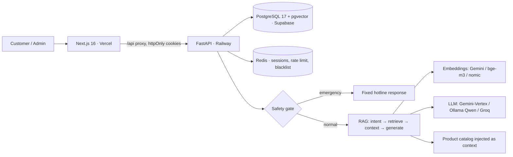

# Qiki — AI shopping assistant for a Vietnamese LPG retailer

Qiki is the AI assistant behind **Cửa hàng Gas Quốc Cường**, a production full-stack
storefront selling LPG gas and bottled water in Ho Chi Minh City. Customers browse
the catalog, check out, or just chat: Qiki answers questions in Vietnamese, quotes
**live catalog prices**, escalates safety emergencies, and takes gas & water orders —
grounded in a retrieval-augmented (RAG) pipeline with a hard safety gate.

[](https://github.com/Rhynis/Gas-Rag-bot/actions/workflows/ci-backend.yml)
[](https://github.com/Rhynis/Gas-Rag-bot/actions/workflows/ci-frontend.yml)


[](LICENSE)

## Live

- **Storefront** — deployed on Vercel _(set the production URL here)_
- **Backend API** — https://gas-rag-bot-production.up.railway.app
- **API docs** — https://gas-rag-bot-production.up.railway.app/docs
- **Repository** — https://github.com/Rhynis/Gas-Rag-bot

## What it does

- **Storefront** — product catalog (gas 6/12/45 kg + water), cart, guest & account checkout, order tracking.
- **Qiki chatbot** — Vietnamese RAG assistant that:
  - answers product / delivery / safety / FAQ questions from a knowledge base,
  - quotes **exact live prices** from the product catalog (not the LLM's guess),
  - asks which brand/variant when a price query is ambiguous, and answers superlative/range queries deterministically via SQL,
  - reuses a logged-in customer's saved default address for orders,
  - **short-circuits gas-safety emergencies** (leak/fire/suffocation) to a fixed hotline response — never the LLM.
- **Admin** — dashboard for chats (statuses, flags, escalation, staff replies), orders, products (`is_active`, stock, pricing), knowledge base, users, and an in-app admin handbook (`/admin/guide`).
- **Pluggable AI providers** — switch generation and retrieval between cloud (Gemini) and fully-local (Ollama Qwen 2.5 7B + bge-m3) via env, incl. a Cloudflare-tunnel "hybrid local demo" mode.

## Architecture



Details: [architecture](docs/architecture.md) · [decisions/ADRs](docs/architecture-decisions.md) · [chatbot pipeline](docs/chatbot-pipeline.md) · [local RAG providers](docs/LOCAL_RAG.md).

## Tech stack

| Layer      | Technology                                                                                                                         |
| ---------- | ---------------------------------------------------------------------------------------------------------------------------------- |
| Frontend   | Next.js 16 (App Router), TypeScript (strict), Tailwind CSS, shadcn/ui, TanStack Query                                              |
| Backend    | FastAPI, Python 3.11, async SQLAlchemy 2.0, Pydantic v2, Alembic                                                                   |
| Database   | PostgreSQL 17 + pgvector (Supabase)                                                                                                |
| Cache      | Redis 7 (sessions, rate limiting, token blacklist)                                                                                 |
| Generation | Gemini (Vertex) · Ollama Qwen 2.5 7B (local) · Groq fallback                                                                       |
| Retrieval  | 4 vector spaces — Gemini `gemini-embedding-001` (768), Jina `v3` (768, fallback), Ollama `nomic-embed-text` (768), `bge-m3` (1024) |
| Eval / Obs | DeepEval, RAGAS-style metrics, Langfuse, Sentry                                                                                    |
| Deployment | Vercel · Railway · Supabase · Cloudflare Tunnel (local demo)                                                                       |

## Measured metrics

Real numbers from this repo (not targets):

| Metric                         | Value                                                                    | Source                                                    |
| ------------------------------ | ------------------------------------------------------------------------ | --------------------------------------------------------- |
| Safety-emergency detection     | **100%** (86/86, 0% false positives)                                     | `scripts/run_evaluation.py --suite safety` (CI hard gate) |
| Automated tests                | **736 backend + 103 frontend**                                           | pytest / vitest + Playwright e2e                          |
| Backend coverage               | **~86%**                                                                 | `pytest --cov` in CI                                      |
| Retrieval quality (bge-m3, VN) | relevant docs **0.62–0.71** vs off-target **< 0.55** (cleanly separable) | measured on the 48-doc production KB                      |
| Eval suites                    | **232 cases** (intent 96 · rag 50 · safety 86)                           | `backend/data/eval/*.json`                                |
| Production scale               | 22 products · 48 KB docs · 350 conversations · 1.3k messages             | live Supabase                                             |

> Latency, Lighthouse, intent-accuracy and RAGAS context-precision benchmarks are
> not yet automated here; they are intentionally omitted rather than estimated.

## Quick start

```bash
cp .env.example .env    # fill secrets (DB, Redis, LLM keys)
make docker-up          # Postgres + Redis
make dev                # backend (FastAPI) + frontend (Next.js)
```

Fully-local / offline (no cloud AI keys): see [docs/local-demo-mode.md](docs/local-demo-mode.md) —
pull Ollama models, set `LLM_PROVIDER=ollama` + `EMBEDDING_PROVIDER=bge`.

## Project structure

```text
frontend/    Next.js 16 app (storefront + admin + Qiki chat widget)
backend/     FastAPI: api → services → repositories; RAG, safety, eval, migrations
docs/        architecture, ADRs, API, security, deployment, ops, local-RAG
cloudflare/  Cloudflare Tunnel setup for hybrid local-demo mode
.github/     CI (lint, type-check, mypy, tests, e2e, coverage gate, safety eval) + deploy
```

## Notable engineering decisions

- **Safety is never delegated to the LLM** — emergencies match keyword/pattern rules and return a fixed hotline response (100% detection gate in CI).
- **Prices come from the catalog, not the LLM or KB** — the product catalog is injected as context; price/superlative queries resolve deterministically via SQL, so a small local model can't misquote.
- **Pluggable providers** — Strategy/Factory over 3 generators × 4 embedding spaces; the same chatbot runs cloud or fully offline.
- **httpOnly-cookie auth** — no tokens in JS; access/refresh cookies + Redis blacklist.
- **asyncpg-safe migrations** — one statement per `op.execute()`; DB functions/triggers for order & conversation codes.

See [docs/architecture-decisions.md](docs/architecture-decisions.md) for the full list.

## Documentation

[architecture](docs/architecture.md) · [decisions](docs/architecture-decisions.md) · [api](docs/api.md) · [chatbot pipeline](docs/chatbot-pipeline.md) · [local RAG](docs/LOCAL_RAG.md) · [local demo mode](docs/local-demo-mode.md) · [security](docs/security.md) · [deployment](docs/deployment.md) · [hosting](docs/HOSTING.md) · [operations](docs/operations.md) · [development](docs/development.md)

## Contributing

1. Branch from `main`.
2. Code, comments, docs, and commit messages in **English**; user-facing UI text, LLM prompts, and KB content in **Vietnamese**.
3. Run tests + linters (`ruff`, `mypy`, `eslint`, `prettier`) before opening a PR.

## License

MIT. See [LICENSE](LICENSE).
