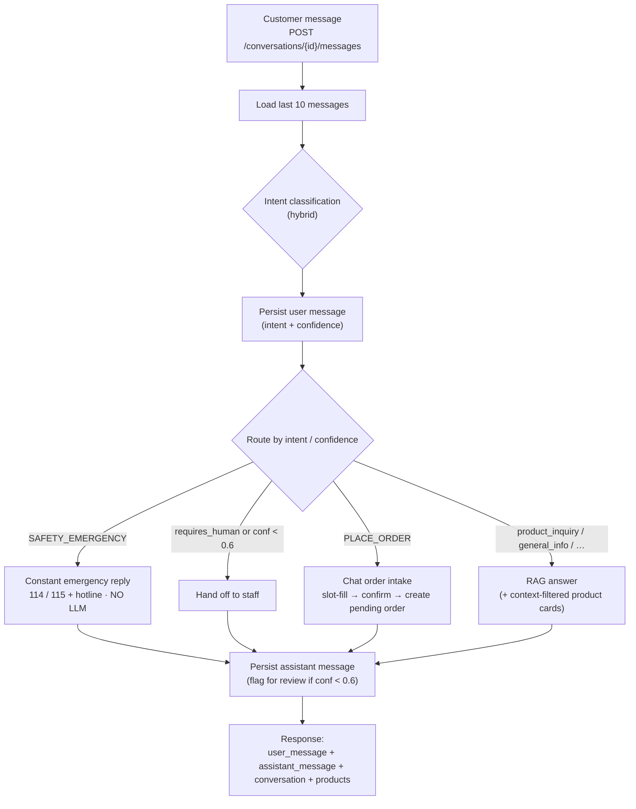
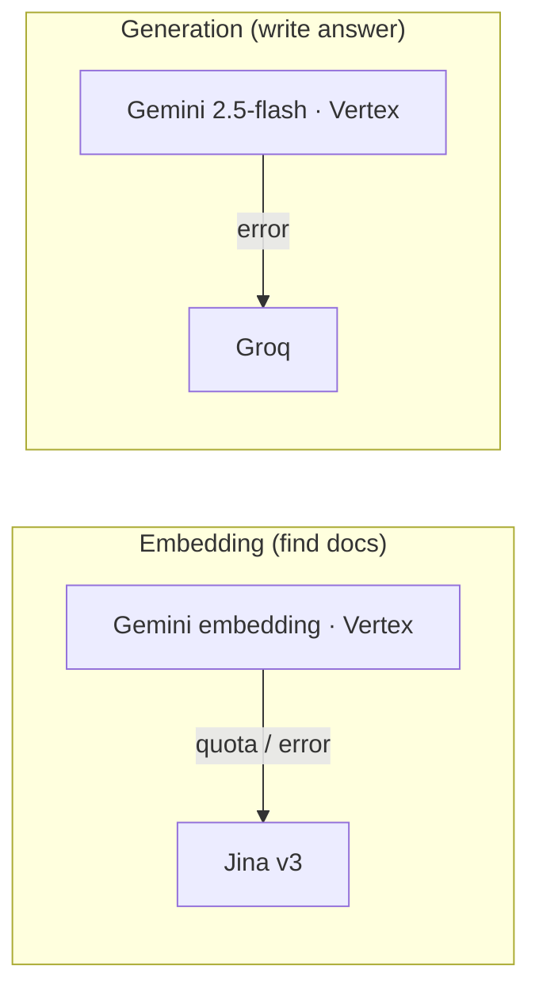
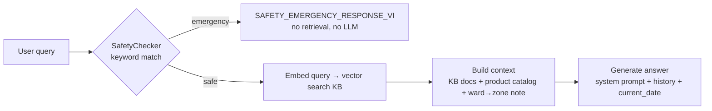

# Chatbot Pipeline (Qiki)

How a single customer turn flows through the backend, and which AI providers run
at each step. Qiki is the assistant for **Cửa hàng Gas Quốc Cường**.

Entry point: `POST /api/v1/conversations/{id}/messages` →
`ConversationService.send_message`.

## Per-turn flow

## Two AI jobs per turn (independent fallback chains)

Each turn does **two distinct jobs** — embedding (find KB docs) and generation
(write the answer). Each has its own primary + fallback. They are not
interchangeable: Jina only produces search vectors, Groq only writes text.

| Job | What it does | Primary | Fallback |
| --- | --- | --- | --- |
| **Embedding** | Vectorize text for intent classification + KB retrieval | Gemini `gemini-embedding-001` (Vertex AI) | Jina `jina-embeddings-v3` |
| **Generation** | Write the Vietnamese reply + chat-order slot extraction | Gemini `gemini-2.5-flash` (Vertex AI) | Groq (`FallbackLLMProvider`, active only if `GROQ_API_KEY` set) |

Notes:
- "Gemini" runs through **Vertex AI** in production (`GEMINI_USE_VERTEX=true`).
  The AI Studio Developer API path (`api_key`) is only used when Vertex is off
  (local/dev).
- KB rows store **both** a Gemini and a Jina embedding, so retrieval can fall
  back to Jina without re-seeding.
- Ollama is a separate local-only provider (local demo mode); it is not used in
  production.

## Intent classification (hybrid)

`HybridIntentClassifier`: try the embedding classifier first; fall back to the
LLM classifier when embedding confidence is below the threshold (`0.7`) or the
embedding API hits a quota/rate error. `SAFETY_EMERGENCY` is always
double-checked. Confidence `< 0.6` flags the message for human review.

## RAG answer pipeline

For non-emergency, non-handoff intents, `RAGPipeline.query` runs:

Stage reference:
1. **Safety check** — `SafetyChecker.check_query` (keyword-based). On emergency,
   return the constant `SAFETY_EMERGENCY_RESPONSE_VI` (114 / 115 + shop hotline)
   without any retrieval or LLM call.
2. **Retrieve** — embed the query and vector-search the knowledge base.
3. **Build context** — retrieved KB docs + the full product catalog (price list)
   + an address note when the message mentions a deliverable ward
   (Bình Thạnh / Thủ Đức).
4. **Generate** — call the LLM with the system prompt, recent history, and the
   current Vietnam date so tense is correct.

## Branch-specific behavior

- **Product cards** are attached for `product_inquiry` / `place_order`. They are
  filtered to products relevant to the question (brand and/or cylinder size); a
  broad/advice question returns the full catalog. The LLM still receives the
  full catalog as text context.
- **Chat order intake** (`place_order`): the LLM extracts order slots from the
  conversation, the service validates product/stock/phone/delivery-zone, asks
  for explicit confirmation, then creates a guest order with `status=pending`
  and replies that staff will call to confirm.
- **Handoff**: low-confidence or human-required intents are routed to staff.
